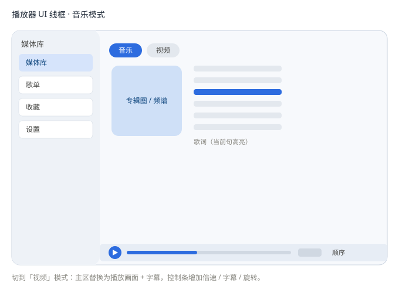
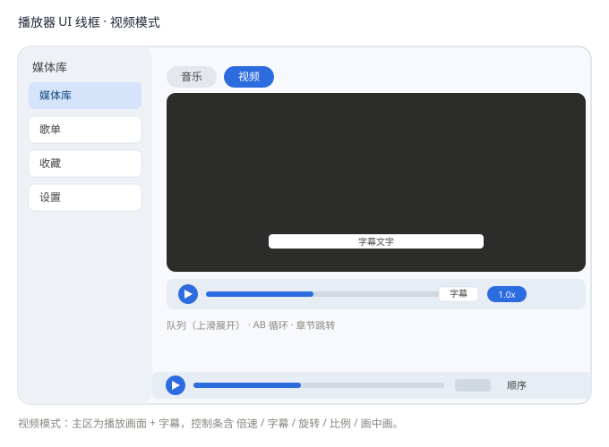

# 离线媒体播放器 · UI 设计文档

> 版本：v1.0　|　日期：2026-08-11　|　状态：设计定稿（待实现）
> 形态：PWA 网页应用（PC + 移动端，离线优先）
> 对标：音乐学 **酷狗**（歌词 / EQ / 频谱），视频学 **影音先锋**（字幕 / 倍速 / 续播）

## 1. 设计目标
- 一套界面同时服务**音乐 + 视频**，靠"模式切换"而非两个 App。
- **离线优先、零安装**；移动端可"添加到主屏"当 APP 用。
- 体验对标：音乐学酷狗（歌词 + EQ + 频谱），视频学影音先锋（字幕 + 倍速 + 续播）。

## 2. 产品定位与技术形态
- **技术形态**：PWA（纯前端，Service Worker 缓存应用壳 + Manifest 可安装）。一套代码运行于 PC（Chrome/Edge 安装到桌面）与安卓（添加到主屏）；iOS 能力受限（见 §14）。
- **离线运行方式**：以 `http://localhost` 或 https 托管后"安装"，断网可用；纯 `file://` 双击也能播本地文件，但无"可安装 / 离线壳"。
- **命名**：「绿角犀播放器 / GreenRhino」，短名「绿角犀」用于桌面 / 主屏图标；图标为 SVG，可按需替换。

## 3. 信息架构
- **侧边栏**：媒体库 / 歌单 / 收藏 / 设置
- **主区（两种模式）**
  - 音乐模式：专辑图 / 实时频谱 + 歌词面板
  - 视频模式：播放画面 + 字幕 + 控制条
- **常驻底栏**：正在播放（封面 · 标题 · 进度 · 播放/暂停 · 音量 · 模式）

## 4. 主要界面
### 4.1 媒体库
- 文件夹导入；按「音乐 / 视频」分类网格；显示最近播放。
- 顶部搜索框 + 筛选标签（全部 / 音乐 / 视频）+ 排序（文件夹 / 添加时间）。
- 空状态引导（见 §9 找内容）。

### 4.2 音乐播放页
- 左侧专辑大图（或实时频谱画布），右侧滚动歌词（当前句高亮，可点击跳转）。
- 底部控制 + EQ 入口；背景取专辑主色模糊渐变（酷狗沉浸感）。

### 4.3 视频播放页
- 居中播放画面；底部控制条含 播放/暂停、进度、倍速、字幕选择、旋转/比例、截图。
- 支持画中画、音轨 / 字幕轨选择、AB 循环、章节跳转。

### 4.4 设置
- 主题（深 / 浅）、默认音量、续播开关、EQ 预设、存储管理（缓存占用 / 清理 / 导入记录）。

## 5. 视觉规范
- **配色**：深色为主（底 `#0E1116` / 卡片 `#181C22` / 强调蓝 `#2D6CDF`），浅色可选。
- **字体**：系统无衬线；标题 15 / 正文 13 / 辅助 12。
- **圆角**：卡片 12、按钮 8；间距用 8 的倍数。
- **组件**：图标按钮、双色进度条（缓冲 + 已播）、可点击跳转的歌词、频谱画布。

## 6. 交互要点
- 拖拽文件 / 文件夹到窗口即导入。
- 歌词点击跳转；双击进度条 seek。
- 退出自动存进度，再次打开续播。
- 播放模式：顺序 / 随机 / 单曲循环 / 列表循环。

## 7. 移动端导入方式（用户自选）
媒体库页提供 `手动 | 扫描` 分段控件，默认「手动」：
- **手动添加**：系统选择器逐个勾选手机里的歌曲 / 视频（全平台可用）。
- **自动扫描**：用户先选定文件夹 / 媒体目录，App 自动遍历其中音视频并入库（安卓接近原生；可多次扫描合并去重）。

**平台能力对照**
| 平台 | 手动添加 | 自动扫描（扫文件夹） |
|---|---|---|
| 安卓 Chrome/Edge | ✅ | ✅ 选定文件夹后可枚举 |
| iOS Safari | ✅ 每次选文件 | ❌ 无法枚举文件夹，只能逐个选 |

## 8. 播放体验增强（A）
- **播放队列抽屉**：底栏上滑 / 点队列展开；当前项高亮，支持拖拽排序、点击跳转、左滑移除。
- **系统通知 / 锁屏控制（Media Session API）**：通知栏与锁屏显示封面 + 标题，提供 播放/暂停/上下首；PC 任务栏缩略图可控。
- **手势（移动）/ 快捷键（PC）**：移动—左右滑切歌、双击暂停、视频区上下滑调亮度/音量；PC—空格播放、←→ seek、↑↓ 音量、F 全屏、M 静音。

## 9. 找内容（B）
- **搜索 + 筛选**：实时按 歌名 / 歌手 / 文件名 过滤；标签 全部 / 音乐 / 视频。
- **空状态 / 首次引导**：首次打开引导页主按钮「导入媒体」；空库插画提示；权限失效给明确修复入口。

## 10. 视频专属能力（C）
- **画中画（PiP）**：控制条画中画图标，视频悬浮小窗播放（Chrome/Edge/安卓）。
- **音轨 / 字幕轨选择**：多语言音轨、多字幕切换；外挂字幕「载入字幕」追加。
- **AB 循环 / 章节跳转**：设 A、B 点循环片段；有章节时进度条显示节点可点跳。

## 11. 音乐专属能力（D · 酷狗味）
- **睡眠定时**：15 / 30 / 60 分钟或「播完当前曲停止」，到点淡出暂停。
- **淡入淡出（Crossfade）**：歌曲间 3–8 秒交叉淡入淡出，设置可调。
- **专辑背景模糊**：背景取专辑封面主色模糊渐变，随曲切换平滑过渡。

## 12. 健壮性与设置（E）
- **异常状态**
  - 解码失败：轻提示「该格式暂不支持」，提供「用转码重试（ffmpeg.wasm，后续增强）」入口，不中断列表。
  - 文件丢失：源文件不存在时该项标灰显示「文件已丢失」，可「重新定位」或「从库移除」。
  - 权限收回：文件夹授权过期时弹引导「需重新授权」，一键跳回系统授权。
- **存储管理（设置）**
  - 缓存占用：区分「可清理」（缩略图）与「媒体索引」。
  - 清理：一键清缩略图缓存，不影响索引与进度。
  - 导入记录：历次导入来源 / 时间，可「重新扫描」或「移除该来源」。

## 13. 关键决策记录
| # | 议题 | 决定 |
|---|---|---|
| 1 | 原生后路 | 维持 PWA，接受 iOS 限制 |
| 2 | 格式范围 | 原生格式为主；ffmpeg.wasm 仅做「尝试转码」按钮，不默认加载 |
| 3 | 元数据 | 用 jsmediatags 读标签，文件名兜底 |
| 4 | 歌词 / 字幕 | 仅本地外挂文件，守住纯离线 |
| 5 | 名称 / 图标 | 正式名「绿角犀播放器 / GreenRhino」，短名「绿角犀」+ SVG 图标 |
| 6 | 跨设备 | PC / 手机各自独立，不云同步 |
| 7 | 投屏 / DLNA | 本版不做，列为后续可选 |

## 14. PWA 限制与风险清单
- **iOS Safari**：无全盘自动扫描（只能逐个选）、无系统级桌面歌词 / 悬浮窗、Service Worker 行为受限。
- **离线壳**：需以 localhost / https 托管后才能"安装"并断网使用；纯 file:// 仅能播本地文件。
- **格式**：冷门封装（mkv / flac / wma）依赖 ffmpeg.wasm（按需，非默认）。
- 若要 iOS 全盘扫描 / 系统级桌面歌词，需改 **Flutter / Tauri 原生**方案。

## 15. 线框图
音乐模式：

视频模式：

## 16. 后续演进（本版暂不做）
- 投屏 / DLNA 完整协议
- ffmpeg.wasm 自动转码流水线
- 跨设备云同步
- iOS 原生封装（如确需全盘扫描 / 桌面歌词）
